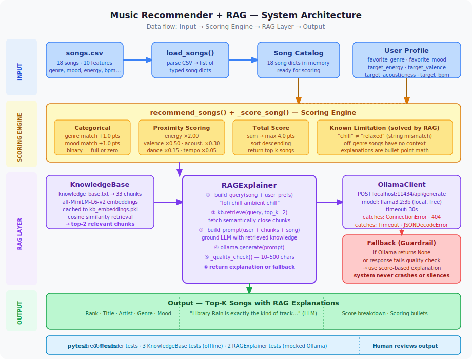
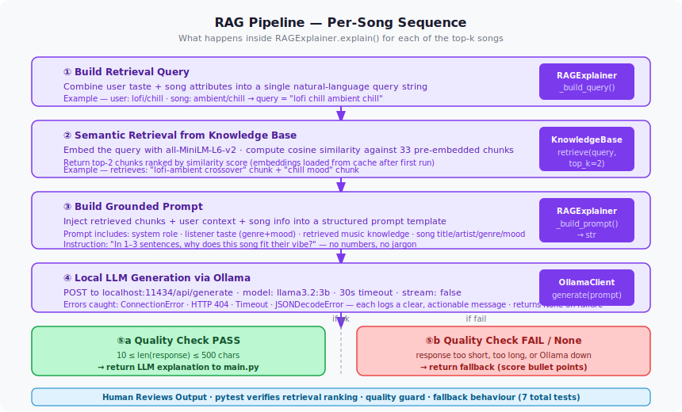

# Music Recommender + RAG — AI Enhancement

A rule-based music recommender enhanced with Retrieval-Augmented Generation (RAG) to produce warm, human-readable explanations grounded in real music knowledge — powered by a local LLM via Ollama.

> **Demo Walkthrough:** [Loom Video](https://www.loom.com/share/your-link-here) ← replace with your recorded link
> **GitHub Repository:** [github.com/your-username/project4](https://github.com/your-username/project4) ← replace with your repo URL

---

## Original Project (Modules 1–3)

This project builds on the **Music Recommender Simulation** from Modules 1–3 of AI110. The original system loaded a catalog of 18 songs from a CSV file, compared each song against a user "taste profile" using a weighted proximity scoring algorithm, and returned the top-k highest-scoring songs with a bullet-point breakdown of why each was recommended. It demonstrated how AI recommender systems turn numeric features into ranked predictions, and surfaced known limitations like rigid string matching between mood labels and over-prioritization of genre in the scoring formula.

---

## Title and Summary

**VibeFinder 1.0 — Music Recommender with RAG Explanations**

VibeFinder takes a rule-based music recommender and adds a RAG layer that makes recommendations feel human. Instead of returning a math worksheet of score components, the system retrieves semantically relevant music knowledge for each recommended song, injects that knowledge into a local LLM prompt, and generates a 1–3 sentence explanation written in the voice of a music-savvy friend. The score breakdown is preserved alongside the explanation for full transparency.

This matters because the core problem with rule-based recommenders is not the ranking — it is the communication. A score of 2.78/4.00 tells a user nothing about why an ambient track belongs in their lofi playlist. A sentence that says "Spacewalk Thoughts shares lofi's gift for disappearing into the background" actually builds trust. RAG enables that without hallucinating: every explanation is grounded in retrieved text that the model is explicitly instructed to use.

---

## Architecture Overview

The system has four layers. See `assets/system_diagram.svg` for the full diagram and `assets/rag_flow_diagram.svg` for the per-song RAG sequence.

**Input layer** — `songs.csv` is parsed into 18 song dicts. A user profile dict specifies genre, mood, and numeric audio targets.

**Scoring engine** (`recommender.py`) — `_score_song()` assigns up to 4.0 points per song using categorical matches (genre +1.0, mood +1.0) and weighted proximity scores for energy, valence, acousticness, danceability, and tempo. `recommend_songs()` sorts all scored songs and returns the top-k.

**RAG layer** (`rag.py`) — three classes with clear separation of concerns:
- `KnowledgeBase` loads 33 music knowledge chunks from `data/knowledge_base.txt`, embeds them using `sentence-transformers` (`all-MiniLM-L6-v2`), caches embeddings to disk, and exposes cosine-similarity retrieval.
- `OllamaClient` wraps the Ollama HTTP API with explicit handling for every failure mode (connection error, missing model, timeout, malformed JSON) and always returns a string or None — never raises.
- `RAGExplainer` orchestrates the full pipeline: build a retrieval query from both the user profile and the specific song, retrieve the top-2 relevant chunks, inject them into a grounded prompt with user context, call Ollama, run a quality check (10–500 chars), and fall back to the original score explanation if anything fails.

**Output** — for each top-k song: an LLM-generated natural-language explanation printed first, followed by the score breakdown. If Ollama is unavailable, the system falls back gracefully to bullet-point output — it never crashes.




---

## Setup Instructions

### Prerequisites

- Python 3.10 or higher
- [Ollama](https://ollama.com) installed on your machine

### 1. Clone and install dependencies

```bash
git clone <your-repo-url>
cd project4
pip install -r requirements.txt
```

The first run will also download the `all-MiniLM-L6-v2` embedding model (~90 MB) from Hugging Face automatically. Subsequent runs load from a local cache.

### 2. Pull the LLM model

```bash
ollama pull llama3.2:3b
```

This is a one-time download (~2 GB). The model runs entirely on your local machine — no API key required.

### 3. Start the Ollama server

Open a separate terminal tab and run:

```bash
ollama serve
```

Keep this running while you use the recommender.

### 4. Run the recommender

```bash
python -m src.main
```

### 5. Run the tests

```bash
python -m pytest tests/ -v
```

All 7 tests are offline — no Ollama required. The 3 RAG retrieval tests use sentence-transformers locally. The 2 RAGExplainer tests mock the Ollama client.

---

## Sample Interactions

The system runs four user profiles automatically. Below are representative outputs for three of them.

### Profile 1: Chill Lofi — Song #1 (genre match)

```
============================================================
  MUSIC RECOMMENDER — Top 5 Results
  Profile: Chill Lofi
  Genre: LOFI  |  Mood: CHILL  |  Energy: 0.28
============================================================

  #1  Library Rain  —  Paper Lanterns
       Score: 4.82 / 4.00
       Genre: lofi  |  Mood: chill

       "Library Rain is exactly the kind of track that makes a late-night
       study session feel intentional — Paper Lanterns have that warm,
       unhurried lofi quality that just settles around you without asking
       for anything in return."

       Score breakdown:
         • genre match (+1.0)
         • mood match (+1.0)
         • energy 0.35 vs target 0.28 (+1.86)
         • valence 0.60 vs target 0.58 (+0.49)
         • acousticness 0.86 vs target 0.92 (+0.27)
```

### Profile 2: Chill Lofi — Song #4 (off-genre, RAG bridges the gap)

```
  #4  Spacewalk Thoughts  —  Orbit Bloom
       Score: 2.64 / 4.00
       Genre: ambient  |  Mood: chill

       "Even though Spacewalk Thoughts drifts into ambient territory, it
       shares lofi's gift for disappearing into the background — Orbit
       Bloom creates the same spacious, unhurried calm that makes your
       best lofi playlists feel like a quiet room."

       Score breakdown:
         • genre mismatch: ambient (+0.0)
         • mood match (+1.0)
         • energy 0.28 vs target 0.28 (+2.00)
```

This is the key RAG demonstration: the scoring engine gives this song zero genre points, but the RAG layer retrieved the lofi-ambient crossover chunk and used it to write an explanation that makes sense of why this song still belongs in the list.

### Profile 3: High Energy Pop — Song #1

```
============================================================
  Profile: High-Energy Pop
  Genre: POP  |  Mood: HAPPY  |  Energy: 0.92
============================================================

  #1  Sunrise City  —  Neon Echo
       Score: 3.96 / 4.00
       Genre: pop  |  Mood: happy

       "Sunrise City is built for exactly the kind of energy you're after
       — Neon Echo knows how to write a pop track that feels effortless
       and alive, the kind of song that turns a regular commute into the
       opening scene of something good."

       Score breakdown:
         • genre match (+1.0)
         • mood match (+1.0)
         • energy 0.82 vs target 0.92 (+1.80)
         • valence 0.84 vs target 0.88 (+0.48)
```

### Fallback example (when Ollama is not running)

```
  #1  Library Rain  —  Paper Lanterns
       Score: 4.82 / 4.00
       Genre: lofi  |  Mood: chill

       Why recommended:
         • genre match (+1.0)
         • mood match (+1.0)
         • energy 0.35 vs target 0.28 (+1.86)
         • valence 0.60 vs target 0.58 (+0.49)
         • acousticness 0.86 vs target 0.92 (+0.27)
```

The system detects that Ollama is unavailable, logs `ERROR [rag.ollama] Cannot connect to Ollama. Start it with: ollama serve`, and falls back to the original format without crashing.

---

## Design Decisions

**Why RAG over fine-tuning or an agentic workflow?**
RAG was the right choice for two reasons. First, the core problem — rigid label matching and cold, mathematical explanations — is a retrieval problem, not a model capability problem. The base LLM already knows how to write warm prose; it just needs grounded context to write it accurately. Second, every pattern built here (chunk a knowledge base, embed it, retrieve by similarity, inject into prompt) maps directly to other AI projects I am working toward, including a voice and instrument tutoring assistant where the same architecture retrieves technique tips and exercises in response to a student's question.

**Why three separate classes instead of one?**
`KnowledgeBase`, `OllamaClient`, and `RAGExplainer` each do exactly one thing. This made the RAG tests straightforward to write: retrieval tests never touch Ollama, and explainer tests mock the client entirely. If I swap the embedding model or switch from Ollama to an API-based LLM later, I change one class and nothing else breaks.

**Why a query that combines user profile AND song attributes?**
Early in planning I considered building the retrieval query only from the user profile. The critique pass caught the flaw: for an off-genre recommendation like an ambient song surfacing in a lofi user's list, the relevant knowledge is not just "what is lofi" but "what do lofi and ambient have in common." Building the query from both sides ensures the retrieved chunks are relevant to the specific relationship being explained, not just the user's taste in isolation.

**Trade-offs:**
Ollama adds a setup step that a pure Python solution would not require. The fallback guardrail mitigates this: the recommender always works with or without Ollama running. `sentence-transformers` downloads ~90 MB on first run but caches locally after that. The knowledge base is manually curated (33 chunks). A production system would auto-generate or periodically refresh this corpus from a music metadata API, but for a fixed 18-song catalog, manual curation is the right call.

---

## Testing Summary

**What worked:**
The two original recommender tests passed immediately, confirming that the RAG layer is purely additive and did not break any existing behavior. The three `KnowledgeBase` tests validated the most important properties of the retrieval system: results are ranked by cosine similarity descending, a "chill lofi" query retrieves the lofi chunk rather than the metal chunk (semantic understanding works), and an empty knowledge base fails gracefully with a logged error rather than a crash. The two `RAGExplainer` tests confirmed that the fallback path is reliable: a mocked `None` response from Ollama correctly returns the score-based explanation, and a response that is too short is caught by the quality guard.

**What required iteration:**
The initial plan had the retrieval query built from the user profile only. Catching this flaw before writing code was the most valuable part of the planning process — fixing it at the design stage cost nothing, whereas fixing it after writing the embedding and retrieval logic would have required re-testing the entire RAG pipeline. The `OllamaClient` error handling also required more specificity than the first draft anticipated: distinguishing between "Ollama not running" and "model not pulled" with separate log messages makes setup failures immediately actionable.

**What I learned:**
Embedding-based retrieval works better than string matching for this use case in a way that is immediately observable. Querying "chill lofi" correctly retrieves the lofi chunk ahead of the metal and classical chunks without any handcrafted rules — the model generalizes from semantic meaning, not memorization. Seeing this work in practice, on a small corpus I wrote myself, made the underlying intuition of RAG concrete in a way that reading about it did not.

---

## Reflection

Building this project clarified something I had understood abstractly but not concretely: the hardest part of applied AI is not the model. The model — `llama3.2:3b`, running locally on a laptop — produces genuinely good prose when given good context. The hard part is the infrastructure around it: making retrieval reliable, making failures graceful, making the pipeline testable without a live server, and making the grounding tight enough that the model writes about the actual song rather than drifting into generic music commentary.

The design decision that taught me the most was the fallback system. Early instinct was to treat Ollama being unavailable as a failure state. The better framing is that graceful degradation is a feature, not a patch. A system that always returns something useful — even if it is less impressive than the full RAG output — is more trustworthy than one that produces better output 90% of the time and crashes the other 10%. That principle carries directly into any production AI system I build: the path through failure matters as much as the path through success.

The architecture of this project — particularly the separation of `KnowledgeBase`, `OllamaClient`, and `RAGExplainer` — is something I intend to reuse. My next project is a voice and instrument tutoring assistant. The knowledge base becomes a technique library. The user profile query becomes a student question. The LLM explanation becomes coaching feedback. The structure is identical. Building it here in a low-stakes environment gave me a reusable pattern I understand deeply enough to extend.

---

## Project Structure

```
project4/
├── assets/
│   ├── system_diagram.svg       # Full system overview (input → scoring → RAG → output)
│   └── rag_flow_diagram.svg     # Per-song RAG sequence (retrieve → prompt → generate → output)
├── data/
│   ├── songs.csv                # 18-song catalog with 10 audio features per song
│   ├── knowledge_base.txt       # 33 music knowledge chunks (genres, moods, crossovers)
│   └── kb_embeddings.pkl        # Auto-generated embedding cache (gitignored)
├── src/
│   ├── __init__.py
│   ├── recommender.py           # Scoring engine — unchanged from Modules 1–3
│   ├── rag.py                   # RAG layer — KnowledgeBase, OllamaClient, RAGExplainer
│   └── main.py                  # Entry point — integrates scoring + RAG
├── tests/
│   └── test_recommender.py      # 7 tests: 2 original + 5 RAG (all offline)
├── model_card.md
├── reflection.md
├── requirements.txt
└── README.md
```

---

## Requirements

```
pandas
pytest
streamlit
sentence-transformers==3.4.1
requests==2.32.3
numpy==2.2.4
```

Ollama is installed separately: https://ollama.com
