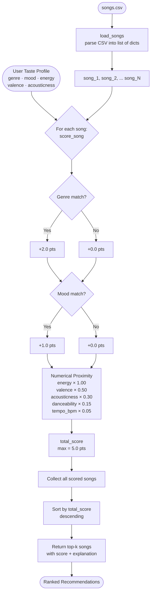

# 🎵 Music Recommender Simulation

## Project Summary

In this project you will build and explain a small music recommender system.

Your goal is to:

- Represent songs and a user "taste profile" as data
- Design a scoring rule that turns that data into recommendations
- Evaluate what your system gets right and wrong
- Reflect on how this mirrors real world AI recommenders

Replace this paragraph with your own summary of what your version does.

---

## How The System Works

The recommender loads a catalog of songs from `data/songs.csv`, compares each song against a user taste profile, assigns it a score out of **5.0 points**, and returns the top-k highest-scoring songs.

### System Flowchart



---

### Song Features Used

Each `Song` record carries ten attributes from the CSV. Seven are used directly in scoring:

| Feature | Type | Role in Scoring |
|---|---|---|
| `genre` | Categorical | Hard filter — +2.0 pts on match |
| `mood` | Categorical | Strong filter — +1.0 pts on match |
| `energy` | Float 0–1 | Proximity score × 1.00 (highest weight) |
| `valence` | Float 0–1 | Proximity score × 0.50 |
| `acousticness` | Float 0–1 | Proximity score × 0.30 |
| `danceability` | Float 0–1 | Proximity score × 0.15 |
| `tempo_bpm` | Float (normalized) | Proximity score × 0.05 (tiebreaker) |

`id`, `title`, and `artist` are carried through for display only — they do not affect the score.

---

### User Profile

The user profile stores the listener's target values for every scored feature:

```python
user_prefs = {
    "favorite_genre":      "lofi",   # categorical anchor
    "favorite_mood":       "chill",  # categorical anchor
    "target_energy":       0.38,     # continuous target (0.0–1.0)
    "target_valence":      0.58,
    "target_acousticness": 0.80,
    "target_danceability": 0.58,
    "target_tempo_bpm":    76,       # normalized before scoring
    "likes_acoustic":      True,     # boolean flag for acousticness branch
}
```

---

### Algorithm Recipe — Finalized

**Categorical scoring (binary — full points or zero):**
```
+2.0 pts  →  genre match
+1.0 pts  →  mood match
```

**Numerical scoring (proximity formula for each continuous feature):**
```
proximity(user_val, song_val) = 1 - |user_val - song_val|

energy_score       = 1.00 × proximity(target_energy,       song.energy)
valence_score      = 0.50 × proximity(target_valence,      song.valence)
acousticness_score = 0.30 × proximity(target_acousticness, song.acousticness)
danceability_score = 0.15 × proximity(target_danceability, song.danceability)
tempo_score        = 0.05 × proximity(norm(target_bpm),    norm(song.tempo_bpm))

  where norm(bpm) = (bpm - 60) / (200 - 60)
```

**Total:**
```
total_score = genre_pts + mood_pts
            + energy_score + valence_score
            + acousticness_score + danceability_score + tempo_score

MAX = 5.0 pts
```

**Ranking:**
```
Sort all (song, score) pairs by total_score descending → return top-k
```

---

### Known Biases and Limitations

**Genre over-prioritization.**
Genre carries +2.0 out of 5.0 possible points (40% of the ceiling). A song with a perfect energy, valence, and mood match but a different genre label will score at most 3.0 — behind any same-genre song that scores above 3.0. A great jazz track will never surface for a pop listener even if the audio feel is identical.

**Mood label rigidity.**
Mood categories are hand-assigned strings (`"chill"`, `"intense"`, `"happy"`). The system treats `"relaxed"` and `"chill"` as completely different despite being sonically adjacent. A user wanting a relaxed vibe gets zero mood points for every "chill" song.

**Catalog size amplifies genre bias.**
With only 18 songs and 13 distinct genres, some genres have only one song. A user whose favorite genre is `"reggae"` will always surface Island Morning as the top result regardless of how poorly its other attributes match — because the +2.0 genre point is unbeatable when there is only one contender.

**No cross-feature interaction.**
The formula treats every feature independently. It cannot represent nuances like "high energy is fine *only when* it is also acoustic" — a preference that many ambient and folk listeners actually hold.

---

## Terminal Output

Running `python3 src/main.py` with the **lofi / chill** profile produces:

```
Loaded songs: 18

============================================================
  MUSIC RECOMMENDER — Top 5 Results
  Profile: LOFI / CHILL / energy 0.38
============================================================

  #1  Library Rain  —  Paper Lanterns
       Score: 4.94 / 5.00
       Genre: lofi  |  Mood: chill
       Why recommended:
         • genre match (+2.0)
         • mood match (+1.0)
         • energy 0.35 vs target 0.38 (+0.97)
         • valence 0.6 vs target 0.58 (+0.49)
         • acousticness 0.86 vs target 0.8 (+0.28)
         • danceability 0.58 vs target 0.58 (+0.15)
         • tempo 72.0 BPM vs target 76 BPM (+0.05)

  #2  Midnight Coding  —  LoRoom
       Score: 4.91 / 5.00
       Genre: lofi  |  Mood: chill
       Why recommended:
         • genre match (+2.0)
         • mood match (+1.0)
         • energy 0.42 vs target 0.38 (+0.96)
         • valence 0.56 vs target 0.58 (+0.49)
         • acousticness 0.71 vs target 0.8 (+0.27)
         • danceability 0.62 vs target 0.58 (+0.14)
         • tempo 78.0 BPM vs target 76 BPM (+0.05)

  #3  Focus Flow  —  LoRoom
       Score: 3.96 / 5.00
       Genre: lofi  |  Mood: focused
       Why recommended:
         • genre match (+2.0)
         • mood mismatch: focused (+0.0)
         • energy 0.4 vs target 0.38 (+0.98)
         • valence 0.59 vs target 0.58 (+0.49)
         • acousticness 0.78 vs target 0.8 (+0.29)
         • danceability 0.6 vs target 0.58 (+0.15)
         • tempo 80.0 BPM vs target 76 BPM (+0.05)

  #4  Spacewalk Thoughts  —  Orbit Bloom
       Score: 2.78 / 5.00
       Genre: ambient  |  Mood: chill
       Why recommended:
         • genre mismatch: ambient (+0.0)
         • mood match (+1.0)
         • energy 0.28 vs target 0.38 (+0.9)
         • valence 0.65 vs target 0.58 (+0.46)
         • acousticness 0.92 vs target 0.8 (+0.26)
         • danceability 0.41 vs target 0.58 (+0.12)
         • tempo 60.0 BPM vs target 76 BPM (+0.04)

  #5  Coffee Shop Stories  —  Slow Stereo
       Score: 1.88 / 5.00
       Genre: jazz  |  Mood: relaxed
       Why recommended:
         • genre mismatch: jazz (+0.0)
         • mood mismatch: relaxed (+0.0)
         • energy 0.37 vs target 0.38 (+0.99)
         • valence 0.71 vs target 0.58 (+0.43)
         • acousticness 0.89 vs target 0.8 (+0.27)
         • danceability 0.54 vs target 0.58 (+0.14)
         • tempo 90.0 BPM vs target 76 BPM (+0.05)

============================================================
```

---

## Getting Started

### Setup

1. Create a virtual environment (optional but recommended):

   ```bash
   python -m venv .venv
   source .venv/bin/activate      # Mac or Linux
   .venv\Scripts\activate         # Windows

2. Install dependencies

```bash
pip install -r requirements.txt
```

3. Run the app:

```bash
python -m src.main
```

### Running Tests

Run the starter tests with:

```bash
pytest
```

You can add more tests in `tests/test_recommender.py`.

---

## Experiments You Tried

Use this section to document the experiments you ran. For example:

- What happened when you changed the weight on genre from 2.0 to 0.5
- What happened when you added tempo or valence to the score
- How did your system behave for different types of users

---

## Limitations and Risks

Summarize some limitations of your recommender.

Examples:

- It only works on a tiny catalog
- It does not understand lyrics or language
- It might over favor one genre or mood

You will go deeper on this in your model card.

---

## Reflection

Read and complete `model_card.md`:

[**Model Card**](model_card.md)

Write 1 to 2 paragraphs here about what you learned:

- about how recommenders turn data into predictions
- about where bias or unfairness could show up in systems like this


---

## 7. `model_card_template.md`

Combines reflection and model card framing from the Module 3 guidance. :contentReference[oaicite:2]{index=2}  

```markdown
# 🎧 Model Card - Music Recommender Simulation

## 1. Model Name

Give your recommender a name, for example:

> VibeFinder 1.0

---

## 2. Intended Use

- What is this system trying to do
- Who is it for

Example:

> This model suggests 3 to 5 songs from a small catalog based on a user's preferred genre, mood, and energy level. It is for classroom exploration only, not for real users.

---

## 3. How It Works (Short Explanation)

Describe your scoring logic in plain language.

- What features of each song does it consider
- What information about the user does it use
- How does it turn those into a number

Try to avoid code in this section, treat it like an explanation to a non programmer.

---

## 4. Data

Describe your dataset.

- How many songs are in `data/songs.csv`
- Did you add or remove any songs
- What kinds of genres or moods are represented
- Whose taste does this data mostly reflect

---

## 5. Strengths

Where does your recommender work well

You can think about:
- Situations where the top results "felt right"
- Particular user profiles it served well
- Simplicity or transparency benefits

---

## 6. Limitations and Bias

Where does your recommender struggle

Some prompts:
- Does it ignore some genres or moods
- Does it treat all users as if they have the same taste shape
- Is it biased toward high energy or one genre by default
- How could this be unfair if used in a real product

---

## 7. Evaluation

How did you check your system

Examples:
- You tried multiple user profiles and wrote down whether the results matched your expectations
- You compared your simulation to what a real app like Spotify or YouTube tends to recommend
- You wrote tests for your scoring logic

You do not need a numeric metric, but if you used one, explain what it measures.

---

## 8. Future Work

If you had more time, how would you improve this recommender

Examples:

- Add support for multiple users and "group vibe" recommendations
- Balance diversity of songs instead of always picking the closest match
- Use more features, like tempo ranges or lyric themes

---

## 9. Personal Reflection

A few sentences about what you learned:

- What surprised you about how your system behaved
- How did building this change how you think about real music recommenders
- Where do you think human judgment still matters, even if the model seems "smart"

